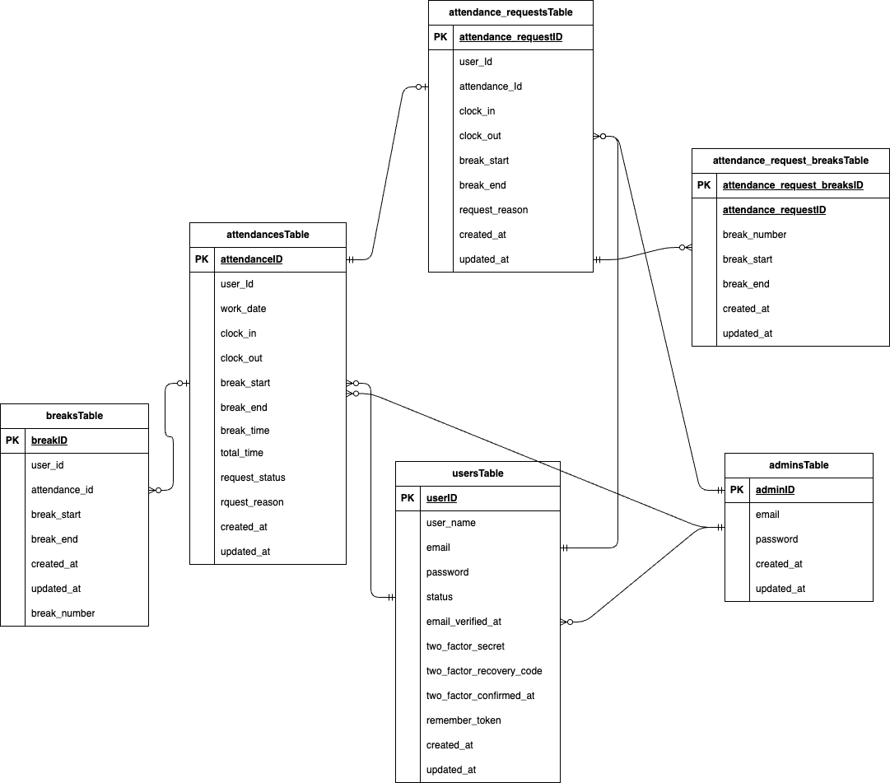

# coachtech-attendance-list

## サービス名

coachtech勤怠管理アプリ

## サービス概要

ある企業が開発した独自の勤怠管理アプリ

制作の背景と目的

ユーザーの勤怠と管理を目的とする

目標

初年度でのユーザー数1000人達成

ターゲットユーザー

	10-30代の社会人

ターゲットブラウザ/os

	PC:Chrome/Firefox/Safari

作業範囲

	設計、コーディング、テスト

納品方法

	Githubでのリポジトリ共有

## 環境構築

## Dockerビルド

    1. git clone git@github.com:Tatsu1438/coachtech-freemarket.git
    2. cd coachtech-freemarket
    3. DockerDesktopアプリを立ち上げる
    4. docker-compose up -d --build

## Laravel環境構築

    docker-compose exec php bash
    composer install

## 環境変数

.env ファイルを作成して以下のように設定してください

    環境変数を以下に変更
	cp .env.example .env
	
	mysql:
    image: mysql:8.0
    environment:
      MYSQL_ROOT_PASSWORD: root
      MYSQL_DATABASE: laravel_db
      MYSQL_USER: laravel_user
      MYSQL_PASSWORD: laravel_pass

    mysql_test:
    image: mysql:8.0
    environment:
      MYSQL_ROOT_PASSWORD: root
      MYSQL_DATABASE: laravel_test_db
      MYSQL_USER: laravel_user
      MYSQL_PASSWORD: laravel_pass

## アプリケーションキーの作成

	php artisan key:generate

	php artisan config:clear
	php artisan cache:clear
	php artisan config:cache

## マイグレーション(test用と本番用)の作成&実行

	php artisan migrate
 	php artisan migrate --env=testing

## テスト方法

以下のコマンドでユニットテストを実行できます

	docker-compose exec php bash
	php artisan test --env=testing

## シーディングの作成&実行

    php artisan db:seed

## シンボリックリンクの作成

    php artisan storage:link

## 使用技術（実行環境）

php:8.1-fpm

mysql:8.0

nginx:1.21.1

Laravel:8.x（バージョン 8.75 以降互換）

mailhog

## 開発環境

URL:

・画面: http://localhost/

・ユーザー登録: http://localhost/register

・ユーザーログイン: http://localhost/login

・管理者ログイン: http://localhost/admin/login

  管理者ログイン情報
    email: admin@example.com
    password: admin12345

・phpMyAdmin: http://localhost:8080/

・mailhog: http://localhost:8025
   

## ER図

## テーブル一覧

### usersテーブル

| カラム名                  | 型             | PRIMARY KEY | UNIQUE KEY | NOT NULL | FOREIGN KEY |
|---------------------------|----------------|-------------|------------|----------|-------------|
| id                        | unsigned bigint| ○           |            | ○        |             |
| user_name                 | varchar(255)   |             |            | ○        |             |
| email                     | varchar(255)   |             | ○          | ○        |             |
| password                  | varchar(255)   |             |            | ○        |             |
| status                    | varchar(255)   |             |            | ○        |             |
| email_verified_at         | timestamp      |             |            | ○        |             |
| two_factor_secret         | varchar(255)   |             |            |          |             |
| two_factor_recovery_codes | text           |             |            |          |             |
| two_factor_confirmed_at   | timestamp      |             |            |          |             |
| remember_token            | varchar(100)   |             |            |          |             |
| created_at                | timestamp      |             |            |          |             |
| updated_at                | timestamp      |             |            |          |             |

### attendancesテーブル

| カラム名        | 型             | PRIMARY KEY | UNIQUE KEY | NOT NULL | FOREIGN KEY |
|-----------------|----------------|-------------|------------|----------|-------------|
| id              | unsigned bigint| ○           |            | ○        |             |
| user_id         | unsigned bigint|             |            | ○        | users(id)   |
| work_date       | date           |             |            | ○        |             |
| clock_in        | time           |             |            |          |             |
| clock_out       | time           |             |            |          |             |
| break_start     | time           |             |            |          |             |
| break_end       | time           |             |            |          |             |
| break_time      | time           |             |            |          |             |
| total_time      | time           |             |            |          |             |
| created_at      | timestamp      |             |            |          |             |
| updated_at      | timestamp      |             |            |          |             |
| request_status  | varchar(255)   |             |            | ○        |             |
| request_reason  | text           |             |            |          |             |

### attendance_requestsテーブル

| カラム名        | 型             | PRIMARY KEY | UNIQUE KEY | NOT NULL | FOREIGN KEY        |
|-----------------|----------------|-------------|------------|----------|-------------------|
| id              | unsigned bigint| ○           |            | ○        |                   |
| attendance_id   | unsigned bigint|             |            | ○        | attendances(id)   |
| user_id         | unsigned bigint|             |            | ○        | users(id)         |
| clock_in        | time           |             |            |          |                   |
| clock_out       | time           |             |            |          |                   |
| break_start     | integer        |             |            |          |                   |
| break_end       | integer        |             |            |          |                   |
| request_reason  | string         |             |            |          |                   |
| created_at      | timestamp      |             |            |          |                   |
| updated_at      | timestamp      |             |            |          |                   |
| request_status  | varchar(255)   |             |            | ○        |                   |

### breaksテーブル

| カラム名        | 型             | PRIMARY KEY | UNIQUE KEY | NOT NULL | FOREIGN KEY      |
|-----------------|----------------|-------------|------------|----------|-----------------|
| id              | unsigned bigint| ○           |            | ○        |                 |
| attendance_id   | unsigned bigint|             |            | ○        | attendances(id) |
| break_start     | time           |             |            |          |                 |
| break_end       | time           |             |            |          |                 |
| break_number    | int            |             |            |          |                 |
| created_at      | timestamp      |             |            |          |                 |
| updated_at      | timestamp      |             |            |          |                 |

### attendance_request_breaksテーブル

| カラム名                | 型             | PRIMARY KEY | UNIQUE KEY | NOT NULL | FOREIGN KEY               |
|-------------------------|----------------|-------------|------------|----------|---------------------------|
| id                      | unsigned bigint| ○           |            | ○        |                           |
| attendance_requests_id  | unsigned bigint|             |            | ○        | attendance_requests(id)  |
| break_number            | int            |             | ○          |          |                           |
| break_start             | time           |             |            |          |                           |
| break_end               | time           |             |            |          |                           |
| created_at              | timestamp      |             |            |          |                           |
| updated_at              | timestamp      |             |            |          |                           |

　　

   

  
